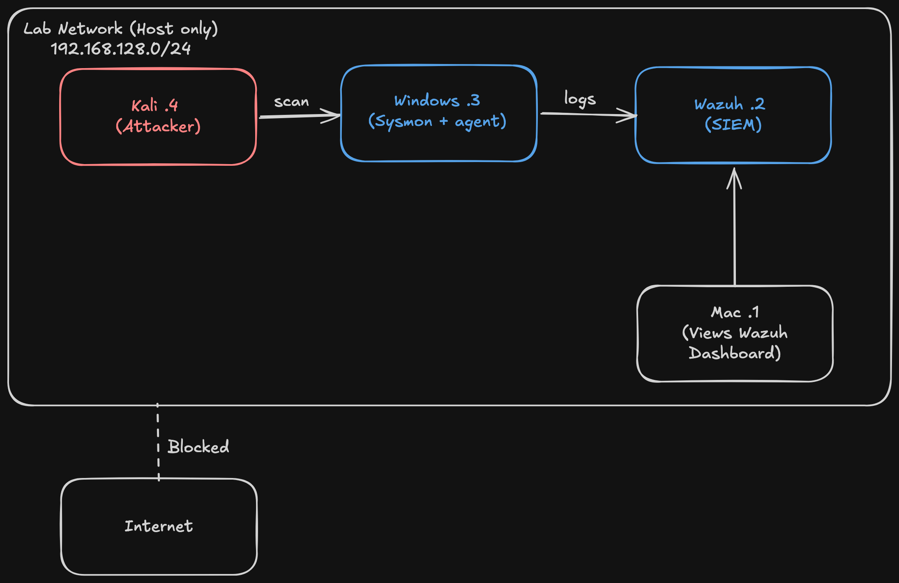

# Home Lab: Isolated Detection Lab

## Overview
I built an isolated detection lab on my Mac using Kali as an attacker (recon), a Windows endpoint running Sysmon, and Wazuh as the SIEM. I built this to build on my understanding of SIEM tools, security monitoring, and data analysis.
## Architecture

| Machine | IP | OS | Role |
|---|---|---|---|
| Kali | 192.168.128.4 | Kali Linux (ARM64) | Attacker |
| Windows | 192.168.128.3 | Windows 11 Pro (ARM64) + Sysmon + Wazuh agent | Target / endpoint |
| Wazuh | 192.168.128.2 | Ubuntu Server 24.04 | SIEM |
| Mac | 192.168.128.1 | macOS (UTM host) | Hosts the VMs, views dashboard |

## Build
- UTM: Hypervisor that was used to host the VMs
- Kali: Attacker used for recon
- Windows + Sysmon: Windows is the target, Sysmon records what happens on the machine
- Wazuh: SIEM monitoring and alerts
- Host Only: Keeps vulnerable systems isolated, VMs can only talk to each other and my Mac. Verified from Kali: ping 8.8.8.8 fails, ping Wazuh works

## Problems I hit
**Storage Problem**
- While setting up Wazuh and connecting it to Windows, my Mac hit ~1 GB of free storage. I deleted ISOs and apps I wasn't using to free up some space. Because the VM was writing to disk while the host was almost full, my Windows VM got corrupted. I did not notice the corruption until the next time I booted.
- I noticed that the VM may be corrupted when boot ran "Fixing (C:)" disk repair and I then received OneDrive "Bad Image" errors. Also, `sfc /scannow` repeatedly failed partway
- Fix: I deleted Win11(Windows VM), re-cloned from Win11-clean, deleted the old agent in Wazuh, and re-enrolled the agent
- Lesson: Keep 20GB+ free on host, shut Windows down from inside, not UTM stop button

**Kali Installation Problem**
- When I first attempted to setup Kali all I saw was a black screen and blinking cursor. To fix this I removed the Display device, added Serial, and installed it via the serial console. After that I got a black screen after the GRUB Menu. GRUB displayed fine, so the display hardware worked. I logged in over serial, ran `systemctl status lightdm`, and saw the desktop was running, which meant the problem was the display card.
- Fix: I changed the display card from virtio-gpu-gl-pci to virtio-gpu-pci, and turned off GPU accel
- Lesson: Narrow down the problem step by step to find the solution, Serial is a backup way in

## Test: recon vs detection
- I ran `sudo nmap -sn 192.168.128.0/24` to find the machines on the network. Host discovery found 4 hosts
- Then I ran `sudo nmap -sV 192.168.128.2` to scan Wazuh. 2 ports were open, 22 for SSH and 443 for the Wazuh dashboard, while 998 were closed
- Then I ran `sudo nmap -Pn -sV 192.168.128.3` to scan Windows while skipping the ping check. All 1000 ports were filtered which means the firewall was dropping everything
- Wireshark: SYN scan was obvious because nmap sent SYN packets to 1000 ports with only microseconds separating each send
- Wazuh caught nothing from the scan on Windows VM. Firewall dropped it silently, Windows Firewall logging is off by default which is a detection gap
- Wazuh showed "Suspicious Process – svchost.exe" at level 12, this is likely a false positive

## What I learned
- Only what is logged can be detected
- There is a detection gap as Wazuh didn't detect the Windows scan because the firewall drops those packets without logging them. This could be fixed with a network IDS like Suricata
- Not keeping enough storage free when working in VMs can lead to VM corruption

## Next
Attacks + my own detection rules
